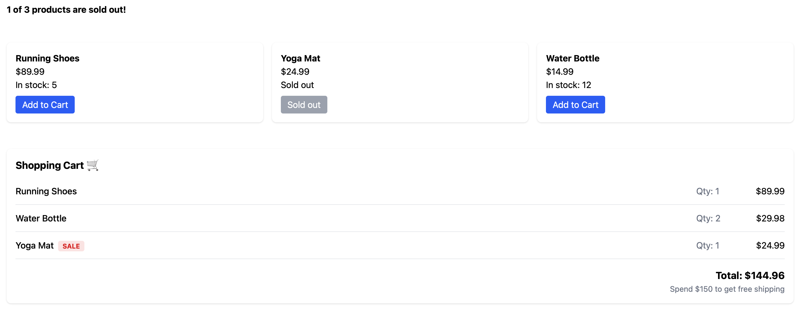

## Tasks

1. Render a `ProductCard` for every product using `.map()`, and don't forget the `key`.
2. If `stock` is `0`, show the text **"Sold out"**. Otherwise show **"In stock: X"**.
3. Change the button text to **"Sold out"** when `stock` is `0`.

### Bonus

Above the grid, show **"1 of 3 products sold out"**. Calculate it from the data instead of hardcoding it.

---

# Additional Task: Shopping Cart 🛒

Add a shopping cart directly below the 3 product cards. It should list every item in the cart and show the total price at the bottom.

You'll practice: components, props, `.map()`, and conditional rendering.

Your final result should look roughly like this:



The cart data is already in `src/data/cart.js`:

```jsx
export const cartItems = [
  { id: 1, name: "Running Shoes", price: 89.99, quantity: 1 },
  { id: 2, name: "Water Bottle", price: 14.99, quantity: 2 },
  { id: 3, name: "Yoga Mat", price: 24.99, quantity: 1, onSale: true },
];
```

Import it in `App.jsx`:

```jsx
import { cartItems } from "./data/cart";
```

## Tasks

### 1. `CartItem` component

Create a `CartItem` component in `src/components/CartItem.jsx` that shows one item:

```
Water Bottle     Qty: 2     $29.98
```

- Show the name, the quantity, and the **line total** (price × quantity).
- In `App`, render one `CartItem` for every item using `.map()`.

### 2. Sale badge

If an item has `onSale: true`, show a small **"SALE"** badge next to its name.

### 3. Total price

Below the cart items, show the **total price** of the whole cart:

```
Total: $144.96
```

## Hints

- Calculate the line total **above the `return`** in `CartItem`:
  ```js
  const lineTotal = price * quantity;
  ```
- To show 2 decimals, use `.toFixed(2)`:
  `lineTotal.toFixed(2)` → `"29.98"`
- To add up the whole cart, use `.reduce()`. It goes through the array and keeps a running total:
  ```js
  const total = cartItems.reduce(
    (sum, item) => sum + item.price * item.quantity,
    0,
  );
  ```
  The `0` at the end is the starting value of `sum`.
- `App` will now return the product grid **and** the cart. Remember: one root element only!

## Bonus ⭐

Below the total, show a message:

- If the total is **$150 or more**: **"🎉 You get free shipping!"**
- Otherwise: **"Spend $150 to get free shipping"**

Then change the Water Bottle's `quantity` to `3` in `cart.js`. Does the message change?

## Extra ⭐ (optional)

Add an `onClick` to the **"Add to Cart"** button in `ProductCard` that shows an alert like
**"Running Shoes added to cart!"**

_Hint:_ `onClick={() => alert("...")}`

Does the cart total change when you click it? Why not? 🤔 (We'll find out why during the second milestone!)
